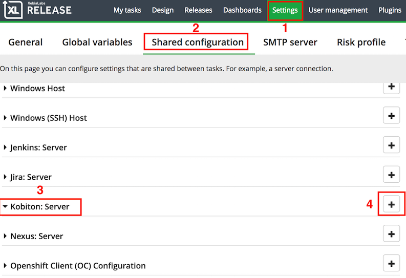

# The Kobiton plugin for XebiaLabs XL Release product

## Table of contents

## A. Preparation
### 1. Getting Kobiton Username and API key
Kobiton Username and API key are required for authenticating with Kobiton API.

> If you don't have a Kobiton account, visit https://portal.kobiton.com/register to create one.

To get your Kobiton Username and API Key, follow instructions at `IV. Configure Test Script for Kobiton` section on [our blog](https://kobiton.com/blog/tutorial/parallel-testing-selenium-webdriver/).

### 2. Getting SSH key for a private repository (Deploy key)
- Please carefully read the folowing note before going to next step:
   
    - This key is used for developers who write test script on a private repository of github.
    - Use this ssh key to authenticate for your github private repository.
    - Do not use passphrase when generate private key.

- If you are ready, visit [this link](https://developer.github.com/v3/guides/managing-deploy-keys/#deploy-keys) to know how to create the deploy key.

## B. Setting up

1. Log your account in XebiaLabs and showing the home page: 

2. Go to __Settings > Shared configuration > Kobiton: Server > '+'__

3. Fill in these information

